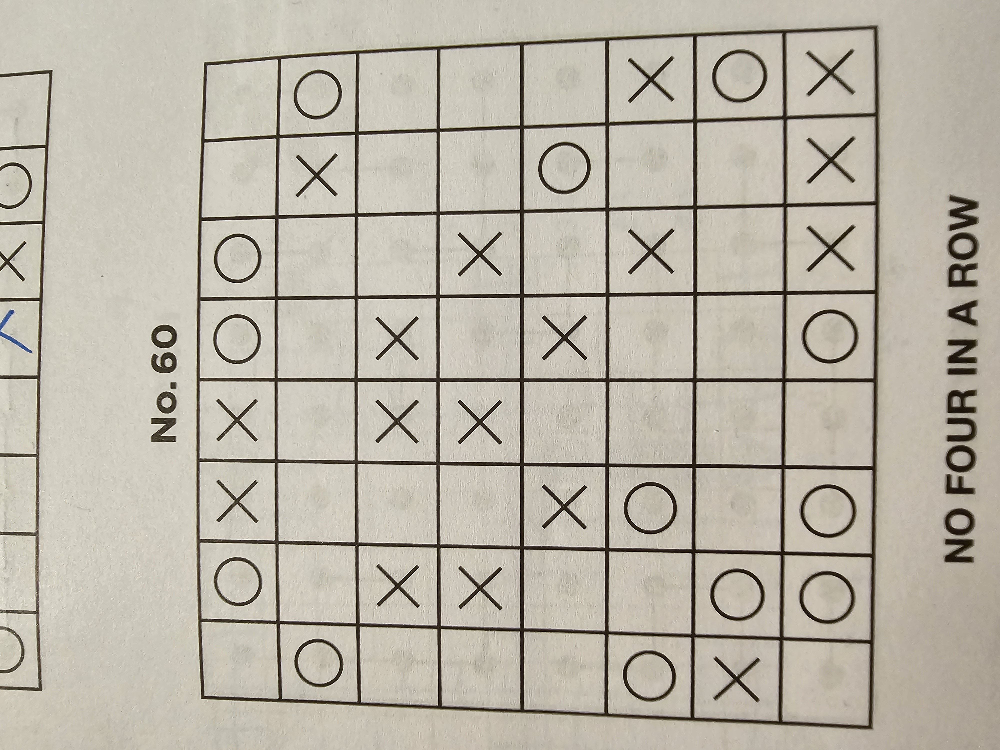

# No Four In A Row 

## Introduction
This project features an algorithmic solver for the engaging puzzle game "No Four In A Row". 

## Game Rules
In "No Four In A Row", you are presented with a square grid containing 'x', 'o', and blank cells.

The objective is to fill all blank cells in such a way that no four consecutive cells, whether vertically, horizontally, or diagonally, contain the same character.



## Getting Started
To get started with this solver:
```
Install dependencies: make install
Run the solver: make run
Format code: make format
Run tests: make test
```


